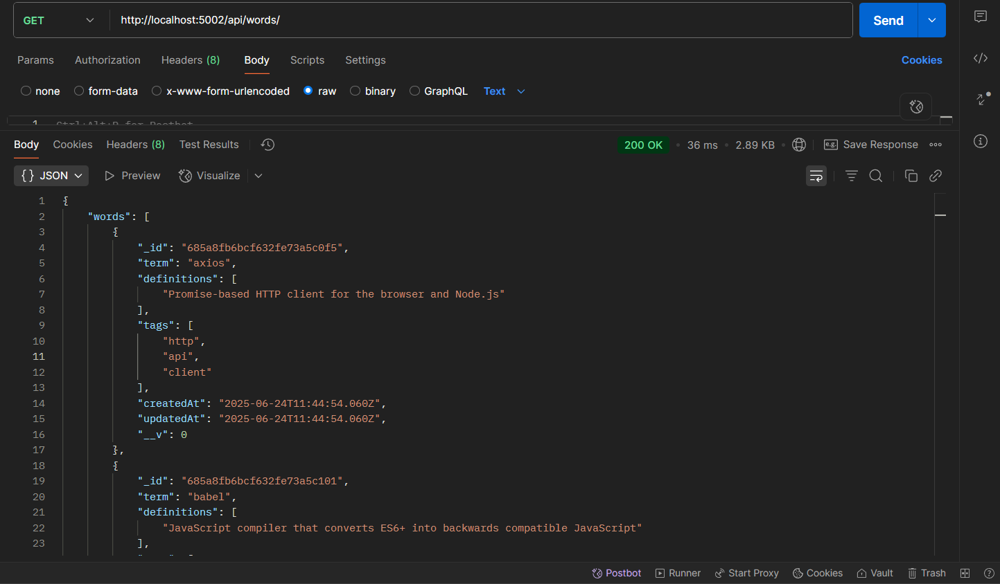
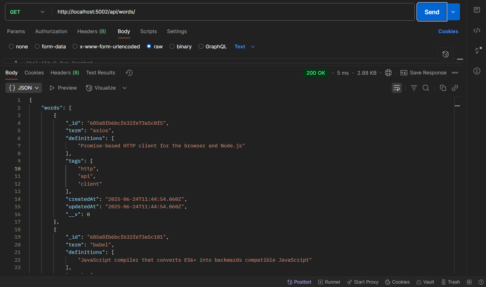
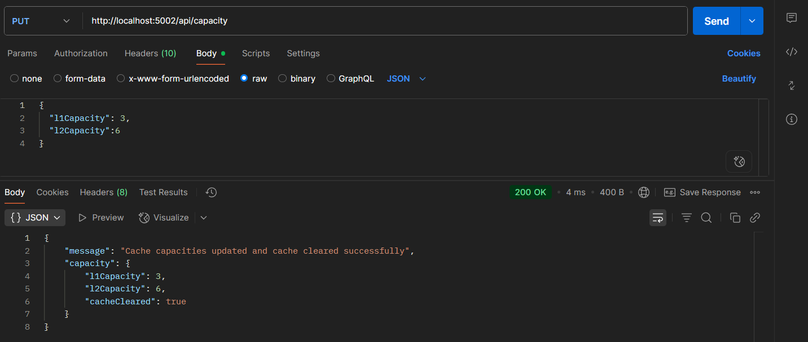
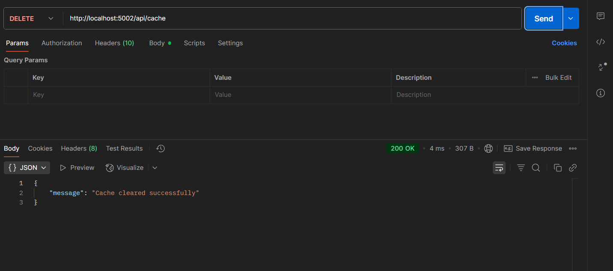
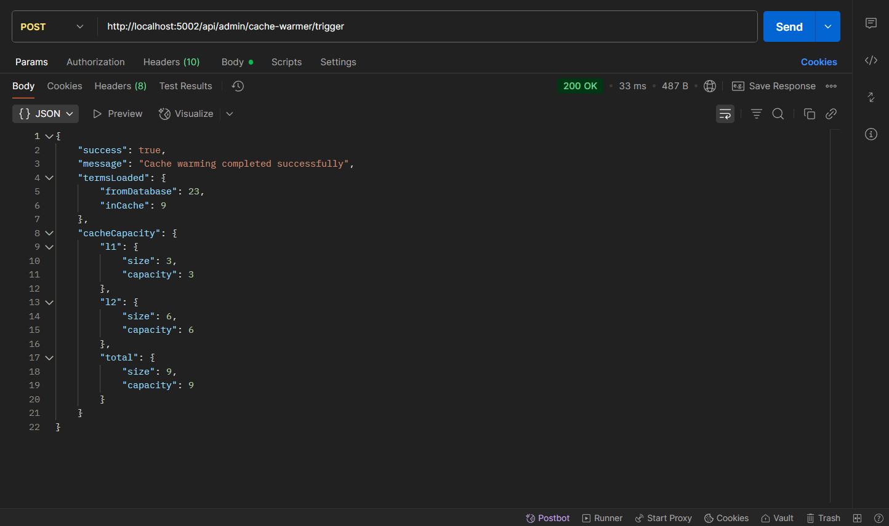

# Custom Multi Level LRUCached Developer Dictionary

A Node.js API that provides programming term definitions with an integrated, **custom-built, faster performance multi-level LRU (Least Recently Used) cache system** (L1/L2), ensuring fast access and efficient memory usage.  
The cache is **implemented from scratch** using a **doubly linked list and hashmap** for true O(1)

## Features

- **Fast API-based Dictionary**: Store and retrieve programming terms and definitions
- **Unified LRU Cache System**: Efficient cache with integrated TTL (Time-To-Live) support
- **Custom Built Multi-level Cache Architecture**: L1 (small, fast) and L2 (larger) cache levels for performance optimization
- **Adjustable Caching Parameters**: API endpoints to control cache capacity and behavior
- **TTL Support**: Automatically expire cached entries after configurable time periods
- **File-based Logging**: Logs cache operations to files instead of console output

## Technology Stack

- **Backend**: Node.js and Express.js
- **Database**: MongoDB with Mongoose ODM
- **Cache System**: Custom unified LRU cache with TTL support
- **Testing**: Automated API tests with custom test runner

## 📸 Postman API Previews

### GET /api/words/



---
### GET /api/words/



---

### POST /api/capacity



---

### DELETE /api/cache



---

### POST /cache-warmer/trigger




## API Endpoints

### Word Operations
- `GET /api/words` - Get all words with pagination
- `GET /api/words/:term` - Get a specific word definition
- `POST /api/words` - Create a new word definition
- `PUT /api/words/:term` - Update an existing definition
- `DELETE /api/words/:term` - Delete a word definition
- `POST /api/words/bulk` - Add multiple word definitions

### Cache Operations
- `GET /api/cache` - Get cache contents
- `GET /api/cache/stats` - Get cache statistics
- `GET /api/cache/:term` - Check if a term is in cache
- `DELETE /api/cache` - Clear the cache

### Capacity Management
- `GET /api/capacity` - Get current cache capacity
- `PUT /api/capacity` - Set new cache capacity

### Admin Operations
- `GET /api/admin/cache-warmer` - Get cache warmer status
- `POST /api/admin/cache-warmer/trigger` - Manually trigger cache warming


## TTL Feature

The system includes a built-in TTL (Time-To-Live) feature for cache entries:

- Default TTL: 300 seconds (5 minutes) for all cache entries
- Custom TTL: Specify a different TTL when creating or updating terms
- TTL metadata: Responses include expiration information

### Example: Creating a term with custom TTL

```json
POST http://localhost:5002/api/words
Content-Type: application/json

{
  "term": "API",
  "definitions": [
    "Application Programming Interface - a set of rules that allows different software to communicate with each other"
  ],
  "tags": ["programming", "integration", "interface"],
  "ttl": 300  // Optional: expire after 5 minutes (300 seconds)
}
```

## Cache Implementation Details

The cache system uses a custom implementation of the LRU (Least Recently Used) algorithm with integrated TTL support:

- **O(1) Operations**: Constant-time performance for get, put, and delete operations
- **Doubly Linked List + HashMap**: Efficient data structure for tracking usage order
- **Two-tier Caching**: L1 (smaller, faster) and L2 (larger) caches working together
- **Automatic Cleanup**: Expired items are removed during access or by periodic cleanup

## Getting Started

### Prerequisites
- Node.js 14.x or later
- MongoDB instance

### Installation

1. Clone the repository
   ```
   git clone https://github.com/yourusername/developer-dictionary.git
   cd developer-dictionary
   ```

2. Install dependencies
   ```
   npm install
   ```

3. Start the server
   ```
   npm start
   ```

## Logging System

The application uses a simple file-based logging system:
- Logs are written to the `logs/cache.log` file
- Cache operations, entry creation/expiration, and warming events are logged
- Console output is kept clean for better readability

## Testing

Run the integrated test suite:

```
npm test
```

This will:
1. Start the server
2. Test all API endpoints
3. Verify cache functionality, including TTL expiration
4. Test CRUD operations for dictionary terms

## Project Structure

```
├─ src/
│  ├─ controllers/          # Request handlers for each route
│  ├─ models/               # Mongoose models for MongoDB
│  ├─ routes/               # API route definitions
│  ├─ utils/                # Utilities including cache implementation
│  │  ├─ CacheManagerUnified.js   # Unified cache manager
│  │  ├─ CacheWarmer.js          # Automatic cache warming utility
│  │  ├─ Logger.js               # File-based logging system
│  │  └─ LRUCacheWithTTL.js      # Core LRU implementation with TTL
│  ├─ server.js             # Main application entry point
├─ assets-postman/          # Screenshots of API responses (used in README)
│  ├─ 1.-Bulk-Post-API-endpoint.png
│  ├─ 2.-Slower-1st-time-lookup-loaded-from-database-Get-all-words-API-endpoint.png
│  ├─ 3.-faster-lookup-fetched-from-custom-built-cache-get-all-words-api-endpoint.png
│  ├─ ...                   # (more screenshots)
├─ .env                     # Environment variables
├─ package.json             # NPM scripts and metadata
└─ README.md                # Project overview and usage guide


```
## Author

Shashank Krishnaprasad

```
## License

This project is licensed under the MIT License - see the LICENSE file for details.
